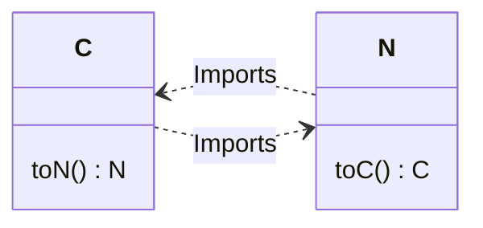
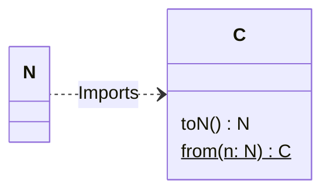

# Code style guide

## Synopsis

This document describes aspects of code style that are not enforced with linters or formatting tools but the project still tries to adhere to. Some of these are things that developers might reasonably disagree on, but the project has a specific stance.

## Topics

### On converting between types

Roughly speaking the code that handles data from the user's server deals with three variations of that data.

1. Data from the network
2. Data cached locally (either to disk or memory)
3. Data displayed to the user

There must be code to convert between those representations, and it's important to make sure there isn't a loop in the dependency graph between the types.

Consider two types, `N`, representing data received from the network, and `C`, representing data that will be cached.

The wrong way to do it is code like:

```kotlin
/** In N.kt (the network data type) */
import C

data class N() {
	fun toC(): C { /* return a C created from a N */ }
}

// ---

/** in C.kt (the cache data type) */
import N

data class C() {
    fun toN(): N { /* return a N created from a C */ }
}
```

This creates a loop in their dependency graph as they import each other's types.



This is a problem because:

- They can't be placed in separate modules
- Modifying code in `N` can cause `C` to be recompiled, and vice-versa

To fix this:

1. Pick one type as being "higher" in the dependency tree than the other
2. Remove the `to...()` method from the lower type, and implement it as a companion `from()` method on the higher type

In Pachli the dependency hierarchy is (higher types on the left):


so the previous example involving a network type and a cache type would instead be written as:

```kotlin
/** In N.kt (the network data type) */
data class N() {
    // No import, no toC() method
}

// ---

/** in C.kt (the cache data type) */
import N

data class C() {
    fun toN(): N { /* return a N created from a C */ }
    companion object {
        fun from(n: N): C {
	        // code from the N.toC() in the previous example
        }
    }
}
```

Now the dependency between the two types is:



The circular dependency is gone, the `N` type can easily be placed in a separate module to the `C` type, and changes to the `C` type will not require the `N` type to be recompiled.

In these examples the `from` method could also have been written as a secondary constructor instead of a static factory method in the companion object. We prefer static factory methods over secondary constructors because:

1. Functions have names that can more clearly indicate their intent
2. Functions can return objects of any subtype. If the example class `C` had multiple subtypes the correct subtype could be returned based on properties of `N`
3. Functions can return null or other values to signify an error. Perhaps the network type is expected to contain a particular property, but the server has a bug and returned data without that property.
4. Functions can have more specific visibility modifiers
5. Functions can be marked `inline`
